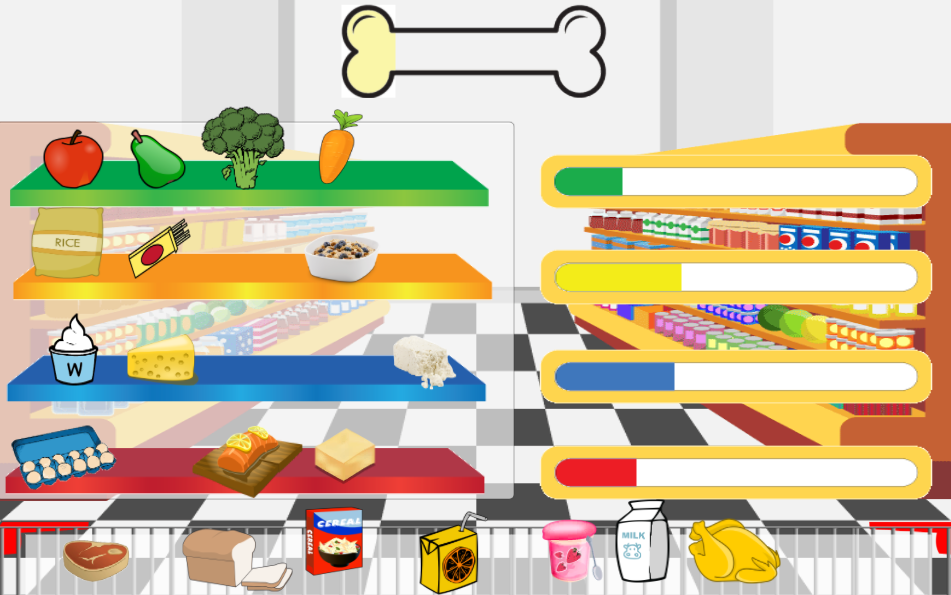

# Rainbow Store Game

This 2D game was developed for during hackathone. Main purpose was to have a dayly calcium level callculated out of products that player chooses.

## Technology used
    
Unity5 was used to develop it. Drag and drop inventory like system was created to accive the effect.

## ScreenShot

